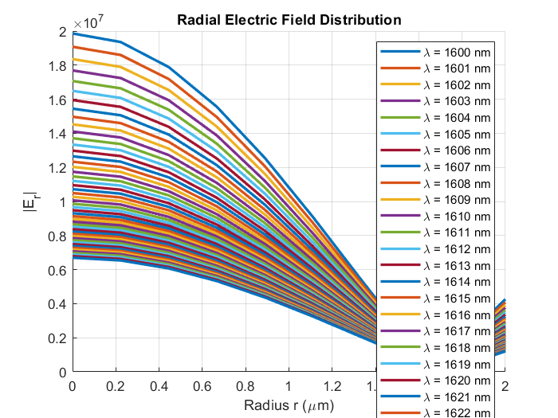

# neff-and-E-decay

## Overview
This MATLAB code calculates the effective refractive index (`neff`) of a single-layer, single-mode optical fiber and evaluates the radial electric field decay from the fiber center. The calculations are based on boundary condition matrices and established theoretical models.

## References
1. **"Cladding Modes of Optical Fibers: Properties and Applications"** - Used for boundary condition matrix calculations.
2. **"Cladding-mode resonances in short- and long-period fiber grating filters" by Erdogan** - Used for electric field decay calculations.

## Features
- Computes `neff` using a determinant method applied to the core matrix.
- Uses numerical root-finding techniques (`fzero` and `fminbnd`) to solve for `neff`.
- Evaluates the radial electric field (`E_r`) at different radii.
- Plots `|E_r|` vs. radius for visualization.

## Dependencies
- MATLAB (Tested on recent versions)
- Symbolic Math Toolbox (for symbolic calculations)

## How It Works
1. **Define Parameters:**
   - Core and cladding refractive indices
   - Core and cladding radii
   - Wavelength and frequency range
2. **Solve for `neff`:**
   - Constructs the core matrix using `matrix_core_calculator`.
   - Finds roots of the determinant equation to obtain `neff`.
3. **Compute `E_r`:**
   - Evaluates the radial electric field using `E_calculator`.
4. **Plot Results:**
   - Visualizes the radial electric field distribution.

## Usage
Run the script in MATLAB to compute `neff` and visualize `|E_r|`. Adjust parameters as needed to explore different fiber configurations.

## Functions
### `matrix_core_calculator(prop_const, wave_num, az_num, radius, epsilon)`
- Constructs the boundary condition matrix for the core.

### `E_calculator(neff, ncore, nclad, radius, rcore, wavenumber)`
- Computes the radial electric field based on `neff`.

## Output
- **`neff_solutions`**: Array of computed effective refractive indices.
- **Plot of `|E_r|` vs. Radius**: Shows the decay of the electric field outward from the fiber center.

## Author
Ali Ahmed

## License
This project is for academic and research use only. Please cite the references if used in published work.

